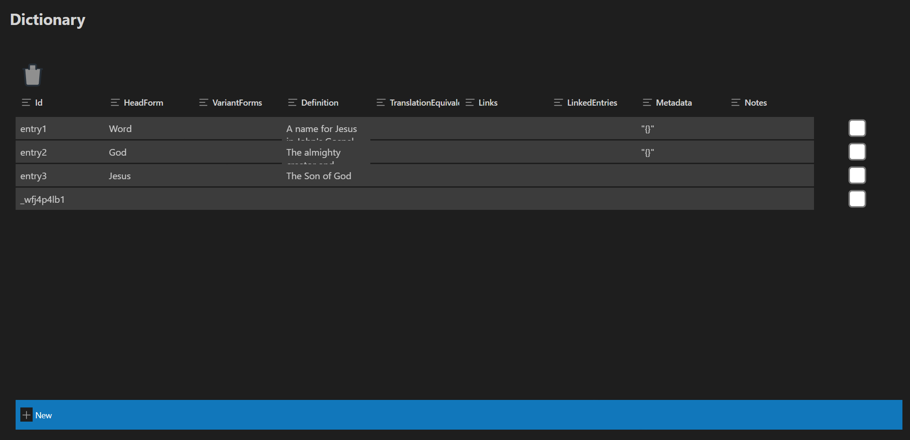

# Dictionary Table (React + Vite)

This is a modification of the default [Hello World](https://github.com/microsoft/vscode-webview-ui-toolkit-samples/tree/main/default/hello-world) sample extension that demonstrates how to set up and use a [React](https://reactjs.org/) + [Vite](https://vitejs.dev/) + [Webview UI Toolkit](https://github.com/microsoft/vscode-webview-ui-toolkit) webview extension.
In this case, it has been modified to display and edit a dictionary.dictionary file containing JSON data of the Dictionary type contained in codex-types.



## Documentation

For a deeper dive into how this sample works, read the guides below.

- [Extension structure](./docs/extension-structure.md)
- [Extension commands](./docs/extension-commands.md)
- [Extension development cycle](./docs/extension-development-cycle.md)

## Run The Sample

```bash
# Copy sample extension locally
git clone https://github.com/genesis-ai-dev/dictionary-table.git

# Navigate into sample directory
cd dictionary-table

# Install dependencies for both the extension and webview UI source code
npm run install:all

# Build webview UI source code
npm run build:table

# Open sample in VS Code
code .
```

Once the sample is open inside VS Code you can run the extension by doing the following:

1. Press `F5` to open a new Extension Development Host window
2. Ensure a dictionary.dictionary file exists within a Dictionary subdirectory 
3. Inside the host window, open the command palette (`Ctrl+Shift+P` or `Cmd+Shift+P` on Mac) and type `Dictionary Table (React + Vite): Show`
